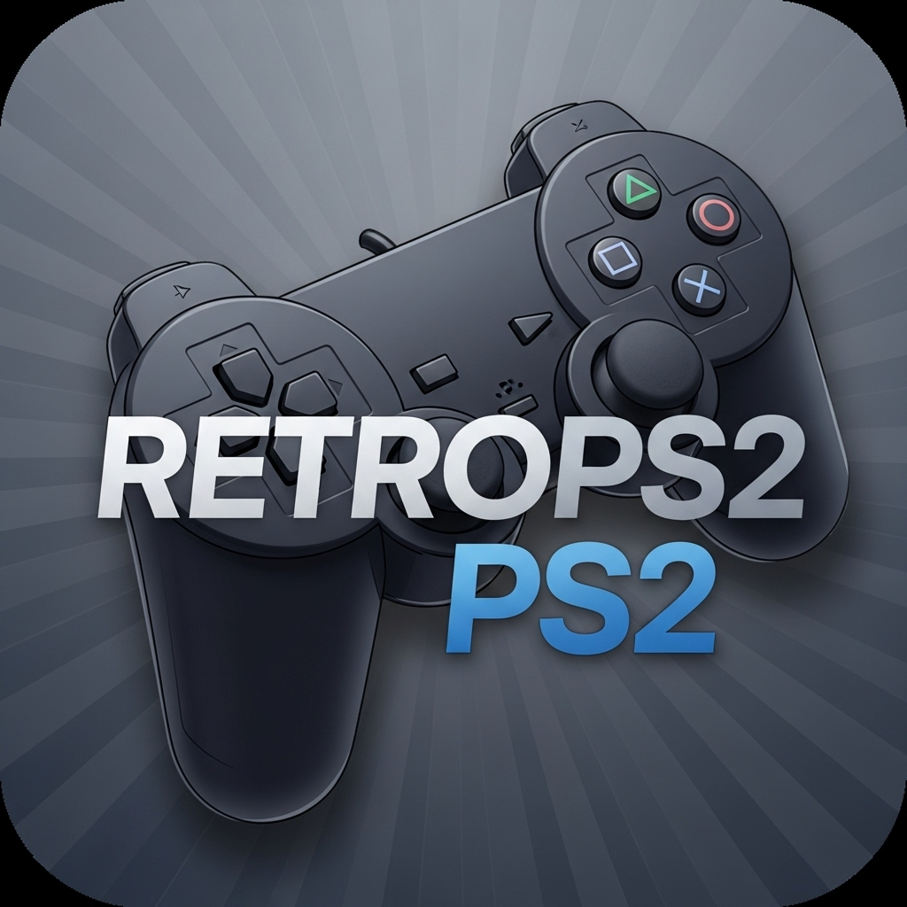

# RETROps2

> **⚠️ IMPORTANTE: Fork Pessoal e de Estudos**
>
> Este é um fork **pessoal** do projeto ARMSX2, criado exclusivamente para **fins de estudo e uso pessoal**.
>
> **NÃO há qualquer finalidade comercial ou lucrativa.**
>
> **Todos os méritos, créditos e reconhecimento pertencem ao desenvolvedor original do ARMSX2.**
>
> 👉 **Projeto Oficial ARMSX2:** https://github.com/ARMSX2/ARMSX2
>
> Por favor, acompanhe e apoie o incrível trabalho do time oficial do ARMSX2!

---

## 📖 Sobre o Projeto

RETROps2 é um fork pessoal do ARMSX2, um emulador gratuito e de código aberto de PlayStation 2 (PS2) para dispositivos ARM, baseado no PCSX2 e PCSX2_ARM64. O objetivo é emular o hardware do PS2 em dispositivos ARM, utilizando um recompilador que opera como x86 -> arm64 (não arm64 nativo), sujeito a mudanças conforme o desenvolvimento continua.

Este fork permite jogar games de PS2 em dispositivos Android móveis, bem como em dispositivos iOS, Linux e Windows.

## 🎯 Detalhes do Projeto Original

O ARMSX2 foi criado após anos sem haver um emulador de PS2 de código aberto para sistemas ARM. O projeto original foi desenvolvido por **MoonPower** com o apoio de **jpolo1224**, como um fork do repositório PCSX2_ARM64 do desenvolvedor Pontos.

O emulador atualmente opera como x86 -> arm64, não arm64 nativo, então o desempenho pode não ser tão bom quanto o AetherSX2 atualmente, porém isso está sujeito a mudanças conforme o desenvolvimento progride.

## 💻 Requisitos do Sistema

- Dispositivos com processador ARM (Android, iOS, Linux, Windows)
- O desempenho dependerá das capacidades de hardware do seu dispositivo
- **Obrigatório:** BIOS dump de um console PS2 legítimo

## 🙏 Créditos e Reconhecimentos

**TODO O MÉRITO E CRÉDITO VAI PARA:**

- **ARMSX2** - Projeto oficial que tornou este fork possível
- **MoonPower** - Desenvolvedor principal do ARMSX2
- **jpolo1224** - Desenvolvedor e colaborador do ARMSX2
- **PCSX2 Team** - Equipe lendária do emulador PCSX2 original
- **Pontos** - Desenvolvedor do PCSX2_ARM64, base do ARMSX2
- **fffathur e EM2008** - Criação do logo
- **tanosshi** - Desenvolvimento do website do ARMSX2

## 🎯 Objetivos Deste Fork Pessoal

| Tarefa | Prioridade |
| --- | --- |
| Corrigir compatibilidade com GPUs Qualcomm (Adreno) | Altíssima |
| Otimização para Qualcomm G3x Gen 2 | Alta |
| Estudos de otimização de performance | Média |
| Testes e documentação em Português | Média |

## ⚖️ Licença e Uso

Este é um projeto de **código aberto** (GPL-3.0) mantido para **fins educacionais e de estudo pessoal**.

**Este fork NÃO:**
- ❌ Tem fins comerciais
- ❌ Visa lucro ou monetização
- ❌ Representa o projeto oficial ARMSX2

**Por favor:**
- ✅ Acompanhe o projeto oficial: https://github.com/ARMSX2/ARMSX2
- ✅ Apoie os desenvolvedores originais
- ✅ Contribua com o projeto oficial sempre que possível 

---

## 🛠️ Desenvolvimento

### Por que existem arquivos .js e .jsx?

Originalmente como uma ideia experimental, as telas React Native foram mantidas no projeto. Elas são extremamente básicas e serão finalizadas em uma branch separada (retrops2-rn) ou removidas completamente. Não afetam a performance pois estão ocultas por padrão e não são executadas. Pull requests são bem-vindos!

### Para começar a desenvolver com RETROps2 RN:

1. Instale as dependências:
```sh
npm install
# ou
pnpm install
# ou
bun install
```

2. Compile o RETROps2 com o core React Native:
```sh
./gradlew assembleDebug -PenableRN=true
```

Um novo botão aparecerá no canto superior direito da tela de seleção de jogos. Clique nele e comece a desenvolver com hot reload, vendo suas alterações sem necessidade de recompilar.

**Nota:** Compilar com RN muda o emucore de estático para compartilhado.

---

## 📞 Contato

**Para questões sobre o projeto oficial ARMSX2:**
- Visite: https://github.com/ARMSX2/ARMSX2

**Para questões específicas deste fork pessoal:**
- Abra uma issue neste repositório (apenas para fins educacionais)

---

**Última atualização:** Janeiro 2025
**Versão:** 0.0.1 (Fork Pessoal)
